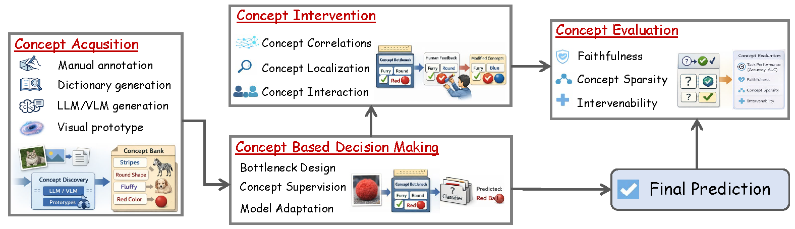
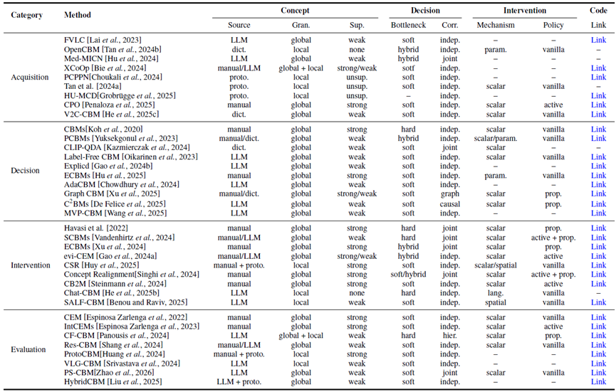

# 概念瓶颈模型

**CBM：Concept Bottleneck Models**

[https://github.com/kkzhang95/Awesome_Concept_Bottleneck_Models](https://github.com/kkzhang95/Awesome_Concept_Bottleneck_Models)

## 为什么需要CBM

因为深度神经网络具有**不透明性**，在需要透明度和人工监管的高风险领域汇总，需要引入人类可理解的**概念层**来连接输入与决策，从而实现**语意解释**和**测试时干预**。

## CBM研究方向

CBM研究框架主要包括：

1. Concept Acquisition（**概念获取**）——如何构建人类可解释的概念
2. Concept-based Decision（**基于概念的决策制定**）——概念层如何中介预测
3. Concept Intervention（**概念干预**）——人类或外部系统如何在推理时与概念交互以纠正或指导推理
4. Concept Evaluation（**概念评估**）——评估以可解释性为导向的属性

## CBM的发展历史

### 早期

1. 概念获取：早期的CBM依赖于**手动定义和标注**的概念，例如视觉属性和临床发现，来提供透明的中间接口。但受到**标注成本**、**覆盖范围**不全和**标签噪声**的限制。

   > 需要专家定义概念并进行标注，费时且容易概念覆盖不全。
   >
2. 基于概念的决策：输入到决策层之间必须经过概念层，即**严格的瓶颈向**（hard bottleneck)
3. 概念评估：以单一的**准确性**指标为主

### 近期

1. 概念获取：可扩展的**词典挖掘**、**LLM/VLM**引导的生成，以及通过**原型或扩散模型**实现的视觉接地发现(Prototype Discovery/Diffusion Discovery)

2. 基于概念的决策：**软性**、**混合**、**概率**和**基于能量(Soft, Hybrid, Probabilistic, Energy-based)**

   > 保留概念接口的同时**提高了预测能力**
   >
3. 概念干预：支持**结构化**和**感知依赖关系**的修正，从而通过概念层更好地传播人类反馈
4. 概念评估：以**可解释性**为中心的指标，如**忠实度（Faithfulness）** 、干预下的**一致性（Consistency）** 、对噪声或缺失概念的**鲁棒性（Robustness）**

## 预备知识

### 概念瓶颈模型

- **概念** $c = (c_1, \cdots,c_K) \in \mathcal{C}^K$表示一组可解释的概念，如视觉属性、解剖结构、病理发现或语义描述。

一个典型的CBM由两个组件组成：

1. **概念预测器:**  $f_{\theta} : \mathcal{X} \rightarrow \mathcal{C}^{K}$. 它将原始输入映射到概念激活。
2. **任务预测器：**​$g_{\phi} : \mathcal{C}^{K} \rightarrow \mathcal{Y}$ . 它仅基于预测的概念产生最终预测

$$
\hat{y} = g_{\phi}\!\left(f_{\theta}(x)\right).
$$

> 1. **语义可解释性：** 每个概念维度都与人类可识别的属性对齐
> 2. **可干预性：** 可在测试时检查或修改概念以纠正推理错误

- 视觉接地(Visual Grounding): 在视觉语言模型中，将自然语言描述与图像中的特定视觉内容相匹配的过程称为Visual Grounding，也称视觉定位。

‍

### 分类法

> 概念**来源**：人工标注(manual)、词典(dict.)、视觉原型(proto.)、大型语言模型(LLM)；  
> 概念**空间粒度**(Gran.)：概念与视觉证据对齐的空间层级：全局(global)、局部(local)或两者；**概念监督**(Sup.)：强(strong)、弱(weak)、无监督(unsup.)；  
> 概念**瓶颈层**(Bottleneck)：硬(hard)、软(soft)、混合(hybrid)；  
> 概念**相关性建模**(corr.)：独立(indep.)、联合(joint)、图(graph)、层级(hier.)、因果(causal)；  
> **干预机制(Mechanism)** ：数值调整(scalar)、参数化(param.)、掩码/注意力编辑(spatial)、自然语言对话(lang.)；  
> **干预策略(Policy)** ：随机/人工选择(vanilla)、模型驱动建议(active)、修正传播(prop.)；

可以看到，一个CBM架构中很可能联合集成概念获取、决策和干预。

‍

## 概念获取

总体趋势：在提高概念质量、可扩展性和视觉接地的同时减少人工监督。

### 基于人工标注的概念

**优点**：确保了**高可解释性**以及与**领域知识**的清晰对齐

**缺点**：受到标注成本、不完全的概念覆盖和标签噪声的限制

|方法|要解决的问题|核心思想|注释|
| ------| ------------------------------| ----------------------------------------------------------------------------------------| ------|
|**容错优化** **CPO [17]**|标签噪声、缺失标签|引入了基于“偏好”的优化|**提高 Concept 学习的鲁棒性**|
|**结构建模 Dependency Modeling [18]**|Concept 相互独立假设过强|添加“侧边通道”变量，用自回归预测，学习概念之间的内部逻辑结构|**Concept 之间有相关性**|
|**部署后修正 Editable CBMs [19]**|Concept 定义错误需要重新训练|使用“影响函数”，允许在模型部署后，直接修正某个概念的定义或标签错误，而不需要重新训练|**模型可以"编辑"**|

> [17] Emiliano Penaloza, Tianyue H Zhang, et al. Addressing concept mislabeling in concept bottleneck models through preference optimization. In ICML, 2025.
>
> [18] Marton Havasi, Sonali Parbhoo, et al. Addressing leakage in concept bottleneck models. In NeurIPS, 2022.
>
> [19] Lijie Hu, Chenyang Ren, et al. Editable concept bottleneck models. In ICML, 2025.

人工标注仍然难以扩展到复杂领域，且其对**预定义概念集的依赖**限制了对不断变化任务的适应性。

### 基于词典的概念构建

从**预定义词汇表**（如形容词列表或医学描述符）中挑选概念，例如WordNet，ConceptNet，医学术语词典。这种方法将**概念空间**限制为语言上有意义的单元。

> 全自动方法模型产生的特征通常是难以解释的，例如，第xx个神经元的输出可能同时对黄色羽毛、光照、羽毛纹理都有响应，这个特征不对应任何人类可以理解的语义。

|方法|要解决的问题|核心思想|注释|
| ------| ------------------------| ------------------------------------------------------------------------------------------| ------|
|**V2C-CBM**|词典里很多词与视觉无关|从大量 n-gram 中生成候选 Concept，再利用 CLIP 过滤掉不能视觉接地（Visual Grounding）的词|**CLIP 帮忙筛词**|
|**OpenCBM**|初始词典覆盖不足|对齐视觉特征与 CLIP Embedding，并自动发现缺失 Concept|**在词典之外继续扩展 Concept**|

> 例如，V2C-CBM构建的n-gram候选池中有happiness、freedom等候选概念，但它们在图片中无法被视觉定位，即非Visual Grounding词。因此，可以采用CLIP的视觉-语言相似度来移除与视觉无关或接地较弱的条目

**优点**：降低了标注成本，降低**幻觉(Hallucination)**

**缺点**：表达能力收到词典限制

### LLM/VLM引导的概念生成

定义：利用 LLM（大型语言模型）或 VLM（视觉-语言模型）自动生成 Concept，而不是人工定义或从词典中筛选。

**优点**：

1. 可扩展性：不需要人为维护词典。
2. 不仅生成低层视觉特征，还能够产生高层语义（更抽象的 Concept）
3. 可以形成概念之间的层次结构，例如Animal-Bird-Water bird-Duck

**缺点**: 

1. 产生幻觉（生成无意义或不符合所提供源内容的输出）
2. 视觉接地差：语言合理但是弱视觉接地的概念
3. 语义不稳定

|方法|要解决的问题|核心思想|注释|
| ------| ------------------------------------------------------------------| --------------------------------------------------------------------------------| ---------------------------------------------------------------------|
|**Med-MICN  [21]**|LLM 生成的概念层次混乱，不同抽象程度的概念混在一起|将概念组织为**多层级（Hierarchy）** ，并引入**门控机制（Gate）** ，根据任务动态选择不同抽象层次的概念|解决概念组织结构问题，提高概念表达的层次性和可解释性。|
|**视觉-语言一致性约束（Vision-Language Alignment）[22,23,24]**|LLM/VLM 生成的概念与图像对应关系弱（Weak Visual Grounding）|利用**CLIP**等视觉-语言模型约束图像特征与文本概念保持一致，提高 Concept 的视觉接地能力|解决Concept 是否真的对应图像内容的问题，是目前很多 CBM 的核心技术。|
|**提示级对齐（Prompt-level Alignment）[25]**|不同 Prompt 导致 LLM 输出 Concept 不稳定（Semantic Instability）|设计或优化 Prompt，使 LLM 生成更稳定、更符合视觉任务的 Concept|属于**Prompt Engineering**，提高 Concept 生成的一致性和可靠性。|
|**Label-free CBM [26]**|没有 Concept 标注，如何学习可解释 Concept|利用**CLIP 的视觉正则化（Visual Regularization）** ，结合语言 Concept，在无 Concept Label 的情况下学习 Concept Bottleneck|"Label-free" 指**没有 Concept Label**，不是没有类别标签。|
|**FCBM [27]**|与 Label-free CBM 相同，希望摆脱人工 Concept 标注|将**LLM 与 CLIP**结合，通过视觉正则化自动诱导 Concept，而不是依赖人工标注|属于 Label-free CBM 的后续工作，与 Label-free CBM 思路相近。|

-  **[21]**  Lijie Hu, Songning Lai, et al. **Towards multi-dimensional explanation alignment for medical classification**. In *NeurIPS*, 2024.  
   *(注：该工作重点在于多维/多层级的医疗解释对齐)*

-  **[22]**  Songning Lai, Lijie Hu, et al. **Faithful vision-language interpretation via concept bottleneck models**. In *ICLR*, 2023.
-  **[23]**  Sukrut Rao, Sweta Mahajan, et al. **Discover-then-name: Task-agnostic concept bottlenecks via automated concept discovery**. In *ECCV*, 2024.
-  **[24]**  Simon Schrodi, Julian Schur, et al. **Selective concept bottlenecks without predefined concepts**. In *TMLR*, 2025.

-  **[25]**  Yequan Bie, Luyang Luo, et al. **Xcoop: Explainable prompt learning for computer-aided diagnosis via concept-guided context optimization**. In *MICCAI*, 2024.

-  **[26]**  Tuomas Oikarinen, Subhro Das, et al. **Label-free concept bottleneck models**. In *ICLR*, 2023.
-  **[27]**  Xingbo Dou, Qiantong Dou, et al. **Flexible concept bottleneck model**. In *AAAI*, 2025.

### 基于视觉原型的概念发现

定义：直接从图像中学习具有代表性的视觉区域（**Prototype**），并将其作为概念

**优点**：视觉**接地能力强**且**可定位**

**缺点**：

1. 语义**命名困难**
2. **伪相关**（Spurious Correlation）：例如，所有企鹅都有蓝色背景，Prototype可能学到背景而不能表达真正的概念。
3. Prototype **数量**的权衡：prototype数量太少 -> 很多概念无法表示；prototype数量太多 -> 解释变得复杂。需要在**覆盖率**和**粒度**之间折中

|方法|要解决的问题|核心思想|注释|
| ------| ----------------------------------| ----------------------------------------------------------------------------------------| -------------------------------------------------------|
|**HU-MCD [28]**|Prototype 语义混杂、难以解释|学习多个**解耦（Disentangled）概念因子**，使每个 Prototype 尽可能表示独立语义|目标是减少一个 Prototype 同时表示多个语义的问题。|
|**LCBM [29]**|Prototype 表达不明确|与 HU-MCD 类似，引入**概念解耦**，学习更加独立、清晰的视觉 Concept|属于解缠（Disentanglement）路线。|
|**部署导向方法（Deployment-oriented）[30, 31]**|已训练模型缺乏解释能力|从**预训练模型**中提取 Prototype Dictionary，为已有模型增加事后可解释性（Post-hoc Interpretability）|不改变原模型，仅增加解释模块。|
|**交互式方法（Interactive Prototype）[32, 33]**|Prototype 无法定位、难以人工干预|将 Prototype 显式关联到**图像区域（Region）** ，支持区域级检查与人工修改|用户可以直接查看或干预某一 Prototype 对应的图像区域。|

-  **[28]**  Arne Grobrügge, Niklas Kühl, et al. **Towards human-understandable multi-dimensional concept discovery**. In *CVPR*, 2025.
-  **[29]**  Sujin Jeon, Inwoo Hwang, et al. **Locality-aware concept bottleneck model**. In *UniReps*, 2024.

-  **[30]**  Andong Tan, ZHOU Fengtao, et al. **Post-hoc part-prototype networks**. In *ICML*, 2024.
-  **[31]**  Mohammad Amin Choukali, Mehdi Chehel Amirani, et al. **Pseudo-class part prototype networks for interpretable breast cancer classification**. In *Scientific Reports*, 2024.

-  **[32]**  Qihan Huang, Jie Song, et al. **On the concept trustworthiness in concept bottleneck models**. In *AAAI*, 2024.
-  **[33]**  Ta Duc Huy, Sen Kim Tran, et al. **Interactive medical image analysis with concept-based similarity reasoning**. In *CVPR*, 2025.

> 由于Prototype 本身没有像 "yellow wing" 这样的**语言标签**，因此很难跨任务、跨数据集复用。因为同一个 Prototype，在不同数据集上可能代表不同的含义。

‍

## 基于概念的决策

### 瓶颈设计（Bottleneck Design）

**瓶颈定义**：模型中人为设置的信息受限的中间表示，所有或绝大部分输入信息必须经过这一表示后才能用于后续任务。瓶颈是在**限制信息通过量**的同时，保留完成任务所需的信息。  
在CBM中，概念瓶颈是位于输入与最终预测之间的中间概念层（Concept Layer），模型要求预测主要或全部通过该概念表示完成，从而使模型决策能够**以人类可理解**的概念进行解释和干预。

|阶段 / 方法|要解决的问题|核心思想|注释|
| -------------| -------------------------------------------------------| ------------------------------------------------------------------| ----------------------------------------------------------------------|
|**① Hard Bottleneck（原始 CBM）**|所有信息必须经过 Concept，导致表达能力不足|强制所有预测信号经过离散 Concept Layer，实现完全可解释|最经典 CBM，也是后续所有工作的起点；可解释性最高，但准确率容易下降。|
|**② 软瓶颈 Soft Bottleneck**  **[34,35]**|Hard Bottleneck 信息损失严重，Concept 难以优化|将 Concept 由离散变量变为**连续激活（Continuous Activation）** ，并联合训练 Concept Predictor 与分类器|提高表达能力，使训练更加稳定，是对 Hard Bottleneck 的第一次放松。|
|**③ 残差通路 Residual Pathways [36]**|Concept 无法覆盖全部有用信息|增加**残差通路（Residual Path）** ，允许部分特征绕过 Concept Layer 直接参与预测|显著提高预测性能，但部分信息失去可解释性。|
|**④ 自回归序列 Autoregressive [18]**|Concept 被假设彼此独立，不符合现实|建模 Concept 之间的依赖关系，例如**自回归预测** Concept|更符合真实世界中 Concept 的层次与关联。|
|**⑤ 图先验 Graph Prior**  **[37,38]**|Concept 间关系未被利用|利用**图结构**（Graph）编码 Concept 的先验关系|将知识图谱或 Concept Graph 引入 CBM，提高鲁棒性。|
|**⑥ 随机潜变量 Stochastic latent**  **[39]**|Concept 存在不确定性，Hard Bottleneck 难以表达|引入**随机潜变量**（Latent Variable），用概率分布表示 Concept|更适合生成模型和复杂场景。|
|**⑦ 能量模型 Energy-based CBM [13]**|Prediction 与 Intervention 被分别处理|使用**能量模型（Energy-based Model）** 统一预测、概念干预与概率解释|将 CBM 放入统一概率框架，是近年来的重要理论方向。|
|**⑧ 因果图 Causal graphs [40]**|Concept 干预缺乏因果保证|将**因果图**（Causal Graph）引入 Concept Layer，使 Intervention 更可靠|作为可解释分析的关联工作，严格来说它并不是 CBM 因果模型本身。|
|**⑨** **概念解耦 Concept decoupling**  **[41]**|一个 Concept 混合多个语义（Concept-Label Distortion）|学习**相互独立**（Disentangled）的 **Concept Embedding**|一个 Concept 尽可能对应一种语义，提高解释质量。|
|**⑩ Differentiable Logic**  **[42, 43]**|线性组合 Concept 表达能力有限|用**可微逻辑**（AND、OR 等）组合 Concept，而不是简单线性加权|更接近人类推理方式，也是近两年的热点方向。|

-  **[34]**  Anita Mahinpei, Justin Clark, et al. **Promises and pitfalls of black-box concept learning models**. In *arXiv preprint arXiv:2106.13314*, 2021.
- [**35]**  Andrei Margeloiu, Matthew Ashman, et al. **Do concept bottleneck models learn as intended?**  In ICLR Workshop on Responsible AI, 2021

-  **[36]**  Chenming Shang, Shiji Zhou, et al. **Incremental residual concept bottleneck models**. In CVPR. 2024.
-  **[18]**  Marton Havasi, Sonali Parbhoo, et al. **Addressing leakage in concept bottleneck models**. In NeurIPS, 2022.
-  **[37]**  Haotian Xu, Tsui-Wei Weng, et al. **Graph concept bottleneck models**. In arXiv preprint arXiv:2508.14255, 2025.

   **[38]**  Nishad Singhi, Jae Myung Kim, et al. **Improving intervention efficacy via concept realignment in concept bottleneck models.**  In ECCV, 2024.
-  **[39]**  Moritz Vandenhirtz, Sonia Laguna, et al. **Stochastic concept bottleneck models**. In NeurIPS, 2024
-  **[13]**  Xinyue Xu, Yi Qin, et al. **Energy-based concept bottleneck models: Unifying prediction, concept intervention, and probabilistic interpretations.**  In ICLR. 2024.
-  **[40]**  Giovanni De Felice, Arianna Casanova, et al. **Causally reliable concept bottleneck models.**  In ICLR 2025 Workshop: XAI4Science: From Understanding Model Behavior to Discovering New Scientific Knowledge, 2025.
-  **[41]**  Rui Zhang, Xingbo Du, et al. **The decoupling concept bottleneck model.**  In TPAMI, 2024.
-  **[42]**  Deepika SN Vemuri, Gautham Bellamkonda, et al. **Logiccbms: Logic-enhanced concept-based learning.**  In WACV, 2026.
- [43] Yibo Gao, Hangqi Zhou, et al. **Learning concept-driven logical rules for interpretable and generalizable medical image classification.**  In MICCAI, 2025.

> **CBM 瓶颈设计的发展，就是不断"放宽瓶颈"——从最初要求所有信息必须经过离散 Concept（Hard Bottleneck），逐步演化到允许连续表示、残差连接、结构建模、概率推理、因果约束和逻辑组合，使模型在保持 Concept 作为解释和干预的对齐语义接口的同时，获得更强的表达能力和更高的预测性能。**

‍

### 概念监督（Concept Supervision）

定义：Concept Supervision 是指如何让模型学习 Concept Layer 中每一个 Concept 所代表的语义

|方法|要解决的问题|核心思想|注释|
| ------| ----------------------------------------------------------------| -----------------------------------------------------------------------------------------| ----------------------------------------------------------------------------|
|**人工概念监督（Early CBMs）[5]**|Concept 需要可靠语义，但完全依赖人工标注|为每个样本提供人工 Concept Label（如*has wing color: blue*），直接监督 Concept Layer 学习|最早 CBM 的标准方案；可解释性最好，但标注成本高、难扩展。|
|**Post-hoc CBMs [44]**|已训练模型没有 Concept Layer，不希望重新训练整个模型|冻结（Freeze）预训练编码器，在其输出特征上训练 Concept Predictor，恢复 Concept 可解释性|**Post-hoc（事后解释）** ：无需修改 Backbone，仅增加解释模块。|
|**Probing-based Methods [45]**|不清楚预训练模型内部是否已经包含可解释 Concept|利用 **Probe（探针）和稀疏正则化**，从预训练 Feature 中读出（Probe）已有的 Concept|Probe 不改变 Backbone，而是分析其内部表示是否包含某种语义。|
|**Prototype Discovery Methods [32, 30]**|没有人工 Concept Label，希望自动发现可解释 Concept|从图像局部区域、部件（Part）或 Prototype 中自动提取具有代表性的视觉单元|Concept 来源于**视觉模式**而非人工定义，强调视觉接地。|
|**CLIP-based / Vision-Language Methods [46, 26, 47]**|人工 Concept 无法扩展到开放词汇（Open Vocabulary）|利用**CLIP**的图文对齐能力，将图像特征与文本 Concept 对齐，实现**开放词汇** Concept Supervision|当前最主流路线之一。**Label-free CBM** 属于这一类，通过 CLIP 实现无需 Concept Label 的监督。|
|**L4LM-guided Strategies [21, 22, 48, 49]**|CLIP 的 Concept 覆盖有限，希望获得更丰富、更符合任务的 Concept|利用 LLM 自动生成**层次化**或任务相关 Concept，再结合 **CLIP/VLM** 完成视觉接地|Concept 更丰富、可扩展性更强，但仍面临幻觉和视觉接地不足的问题。|

> -  **[5]**  Pang Wei Koh, Thao Nguyen, et al. **Concept bottleneck models. In ICML, 2020.**
> -  **[44]**  Mert Yuksekgonul, Maggie Wang, et al. **Post-hoc concept bottleneck models**. In ICLR, 2023.
>
> -  **[45]**  Andrei Semenov, Vladimir Ivanov, et al. **Sparse concept bottleneck models: Gumbel tricks in contrastive learning**. In arXiv preprint arXiv:2404.03323, 2024.
>
> -  **[32]**  Qihan Huang, Jie Song, et al. ​**On the concept trustworthiness in concept bottleneck models**. In AAAI, 2024.
> -  **[30]**  Andong Tan, ZHOU Fengtao, et al. **Post-hoc part-prototype networks**. In ICML, 2024.
>
> -  **[46]**  Rémi Kazmierczak, Eloïse Berthier, et al. ​**Clip-qda: An explainable concept bottleneck model**. In TMLR, 2024.
> -  **[26]**  Tuomas Oikarinen, Subhro Das, et al. ​**Label-free concept bottleneck models**. In ICLR, 2023.
> -  **[47]**  Jiakai Lin, Jinchang Zhang, et al. **Graph integrated multimodal concept bottleneck model**. In arXiv preprint arXiv:2510.00701, 2025.
>
> -  **[21]**  Lijie Hu, Songning Lai, et al. ​**Towards multi-dimensional explanation alignment for medical classification**. In NeurIPS, 2024.
> -  **[22]**  Songning Lai, Lijie Hu, et al. ​**Faithful vision-language interpretation via concept bottleneck models**. In ICLR, 2023.
> -  **[48]**  Yunhe Gao, Difei Gu, et al. ​**Aligning human knowledge with visual concepts towards explainable medical image classification**. In MICCAI, 2024.
> -  **[49]**  Chunjiang Wang, Kun Zhang, et al. ​**Mvp-cbm: Multi-layer visual preference-enhanced concept bottleneck model for explainable medical image classification**. In IJCAI, 2025.

这些方法将概念监督从直接标注转变为基于**对齐和提示**的归纳，实现了可扩展和自适应的概念构建。这种演变保留了CBMs与人类对齐的语义，同时提高了跨任务和领域的灵活性。

‍

### 模型适应（Model Adaptation）

前两节关注的是**训练**阶段，这一节关注的是**部署**阶段

**为什么需要模型适应**：具有固定概念的静态流程在任务需求转变、新概念出现或需要用户修正时难以更新。

|方法|要解决的问题|核心思想|注释|
| ------| ----------------------------------------------------------| ---------------------------------------------------------------------------------| --------------------------------------------------------------------|
|**静态 CBM（Early CBMs）**|模型训练完成后无法适应新任务、新概念或用户反馈|使用固定的 Concept Layer 和固定参数进行预测|传统 CBM 一旦训练完成，通常需要重新训练才能更新 Concept 或模型。|
|**Editable CBMs [19]**|修改某个 Concept、样本或标签需要重新训练整个模型，代价高|利用**影响函数（Influence Function）** 对模型参数进行局部更新，仅修改受影响部分|**Editable（可编辑）** ：支持部署后的细粒度修改（Concept Editing），无需整体重训练。|
|**Energy-based CBMs [13]**|测试阶段难以根据 Concept 修正预测|将推理建模为**输入、Concept 与输出之间的能量最小化（Energy Minimization）** ，支持测试时 Concept Intervention|统一预测、Concept 干预和概率解释，为部署后的动态修正提供理论框架。|
|**Chat-CBM [50]**|用户难以直接与模型交互或修改 Concept|引入冻结 LLM，通过自然语言与 Concept Layer 交互，实现对模型的编辑和修正|**Human-in-the-loop**：普通用户可通过自然语言修改模型行为。|
|**SALF（Spatially-Aware & Label-Free）[51]**|Concept 缺乏空间定位，用户难以指出具体错误区域|将 Concept 与图像空间区域（Spatial Region）绑定，支持区域级解释与交互|不仅能修改"概念"，还能修改"图像中的哪个区域对应概念"。|
|**Test-Time Adaptation (TTA) [52, 53]**|测试数据分布发生变化（Distribution Shift），模型性能下降|在测试阶段利用少量图像级标签或无需训练的方法，对 Concept 或分类器进行自适应调整|**Training-free**或少量监督即可完成适应，无需重新训练整个 CBM，适合真实部署场景。|

> -  **[19]**  Lijie Hu, Chenyang Ren, et al. **Editable Concept Bottleneck Models**. In ICML, 2025
>
> -  **[13]**  Xinyue Xu, Yi Qin, et al. **Energy-based concept bottleneck models: Unifying prediction, concept intervention, and probabilistic interpretations**. In ICLR, 2024.
>
> -  **[50]**  Hangzhou He, Lei Zhu, et al. ​**Chat-cbm: Towards interactive concept bottleneck models with frozen large language models**. In arXiv preprint arXiv:2509.17522, 2025.
> -  **[51]**  Itay Benou and Tammy Riklin Raviv. **Show and tell: Visually explainable deep neural nets via spatially-aware concept bottleneck models**. In CVPR, 2025
>
> -  **[52]**  Townim F Chowdhury, Vu Minh Hieu Phan, et al. ​**Adacbm: An adaptive concept bottleneck model for explainable and accurate diagnosis**. In MICCAI, 2024.
> -  **[53]**  Hangzhou He, Jiachen Tang, et al. **Training-free test-time improvement for explainable medical image classification**. In MICCAI, 2025.

‍

## 概念干预

定义：人为修改 Concept Layer 中一个或多个概念值，修改后概念应该怎样传播。

### 概念相关性

概念之间存在语义和**统计关系，不是相互独立的，** 所以需要Correlation-aware Intervention，即CBM希望概念值的修改能自动传播到其他概念上。这称为**Concept Propagation.**

|方法|要解决的问题|核心思想|注释|
| ------| ------------------------------------------| -----------------------------------------------------------------------------------| ---------------------------------------------------------------------|
|**Independent Intervention（Original CBM）**|修改一个 Concept 不影响其他 Concept|假设所有 Concept 相互独立，人工直接修改某个 Concept 值|最简单，但现实中 Concept 往往存在关联，因此容易产生不一致的结果。|
|**Autoregressive Concept Predictor [18]**|Concept 之间存在依赖关系，独立假设不成立|按顺序预测 Concept，前面的 Concept 会影响后面的 Concept，因此干预可以沿依赖链传播|利用序列依赖 **（Autoregressive Dependency）** 实现 Concept Propagation。|
|**Stochastic CBMs [39]**|如何更自然地传播多个相关 Concept|将所有 Concept 建模为**多元高斯分布（Multivariate Gaussian）** ，利用协方差矩阵描述 Concept 间相关性|修改一个 Concept 后，可根据学习到的协方差自动更新其他相关 Concept。|
|**Energy-Based CBMs [13]**|如何统一预测与 Concept 干预|构建输入、Concept 和输出的联合能量函数，**通过能量最小化（Energy Minimization）** 完成 Concept 修正传播|将 Intervention 视为整体推理过程，而不是单独修改某个节点。|
|**CIRM（Concept Realignment Module）[38]**|干预后其余未修改 Concept 保持不一致|根据学习到的统计相关性，对未干预的 Concept 进行重新对齐（Realignment）|属于**事后修正（Post-hoc Realignment）** ，提高 Concept 一致性。|

>  **[18]**  Marton Havasi, Sonali Parbhoo, et al. **Addressing leakage in concept bottleneck models**. In NeurIPS, 2022.
>
>  **[39]**  Moritz Vandenhirtz, Sonia Laguna, et al. **Stochastic concept bottleneck models**. In NeurIPS, 2024.
>
>  **[13]**  Xinyue Xu, Yi Qin, et al. **Energy-based concept bottleneck models: Unifying prediction, concept intervention, and probabilistic interpretations.**  In ICLR. 2024.
>
>  **[38]**  Nishad Singhi, Jae Myung Kim, et al. **Improving intervention efficacy via concept realignment in concept bottleneck models.**  In ECCV, 2024.

‍

> 虽然这些方法显著提高了干预的一致性和效率，但它们极大地依赖于所学习到的关联质量。如果捕捉到了**伪相关**（Spurious dependencies），干预可能会传播错误而非修正。  
> 因此，**如何让 Concept 的传播遵循真实的因果关系，而不是仅仅依赖统计相关性，是 Concept Intervention 的重要研究方向之一。**

‍

### 概念定位

定义：应该修改哪一个（或哪些）Concept？

**为什么需要**：人工选择概念的缺点——费时间且认知负担高

|方法|要解决的问题|核心思想|注释|
| ------| ----------------------------------------------------------| -------------------------------------------------------------------------------------------| ------------------------------------------------------|
|**人工选择**|用户需要自己判断应该修改哪个 Concept，成本高、认知负担重|完全依赖人工经验选择 Intervention Target|最早 CBM 的默认方式，不适合复杂任务。|
|**Concept Embedding Models [10]**|模型不知道哪些 Concept 更值得修改|在训练阶段模拟测试时干预，学习 Concept 对预测的影响，使模型能够主动推荐需要修正的 Concept|**Train for Intervention**：训练时就考虑未来的人机交互。|
|**Evi-CEM(Evidential Concept Embedding Models) [54]**|模型对某些 Concept 没把握，但不知道哪些最不可靠|将每个 Concept 建模为**Beta 分布**，利用认知不确定性 **（Epistemic Uncertainty）** 评估 Concept 是否值得干预|不确定性越大，越值得人工检查；适合医学等高风险场景。|
|**UCP / LCP [14]**|如何客观评价"修改哪个 Concept 收益最大"|提出**UCP（Uncertainty-based Concept Potential）** 和**LCP（Loss-based Concept Potential）** 等指标，对所有 Concept 排序，优先干预高影响 Concept|属于**事后排序（Post-hoc Ranking）** 方法，不改变模型结构。|
|**FIGS-BD（Adaptive Test-Time Intervention）[55]**|多个 Concept 共同影响预测，单独排序不够|将 Predictor 蒸馏为**Greedy Sum Tree（FIGS）** ，分析 Concept 或 Concept Group 对预测方差的贡献，定位最重要的干预对象|不仅可以定位单个 Concept，还可以发现**Concept Group**，适合复杂决策。|

> [10] Mateo Espinosa Zarlenga, Pietro Barbiero, et al. Concept embedding models: Beyond the accuracy-explainability trade-off. In NeurIPS, 2022.  
> [54] Yibo Gao, Zheyao Gao, et al. Evidential concept embedding models: Towards reliable concept explanations for skin disease diagnosis. In MICCAI, 2024.  
> [14] Sungbin Shin, Yohan Jo, et al. A closer look at the intervention procedure of concept bottleneck models. In ICML, 2023.  
> [55] Matthew Shen, Aliyah R Hsu, et al. Adaptive test-time intervention for concept bottleneck models. In ICLR 2025 Workshop Building Trust, 2025.

‍

### 概念交互

定义：**人应该以什么方式与 Concept Layer 交互？** 如何探索更加自然的人机交互方式？

|方法|要解决的问题|核心思想|注释|
| ------| -------------------------------------------------| ---------------------------------------------------------------------------------| -------------------------------------------------------------------------------------------|
|**传统 CBM（Original Intervention）**|交互方式单一，只能直接修改 Concept 数值|用户直接修改某个 Concept Activation，再重新预测|最基础的 Concept Intervention，要求用户知道每个 Concept 的含义。|
|**Learning to Intervene on Concept Bottlenecks**|如何设计更有效的人机交互策略|学习用户应该如何干预 Concept，以提高交互效率和预测性能|更关注**交互策略**，属于概念交互研究的基础工作。|
|**Chat-CBM**|普通用户难以理解和修改 Concept 数值|利用冻结的大语言模型（LLM）作为 Concept Predictor，允许用户通过自然语言进行交互|**Natural Language Interaction**：例如"我认为这里有病灶"，无需直接修改数值；但由于 LLM 的引入，可解释性可能弱于传统 CBM。|
|**Concept-based Similarity Reasoning (CSR）**|用户希望通过图像区域而不是 Concept 数值进行交互|用户在图像上绘制 Bounding Box，引导模型关注指定区域|**Spatial Interaction**：交互对象从"Concept"扩展到"图像区域"，但不同 Concept 之间仍未显式解耦。|
|**SALF（Spatially-Aware and Label-Free CBM）**|CSR 无法针对同一区域内不同 Concept 分别干预|构建**空间 Concept Graph**，允许用户指定图像区域，并选择性调节该区域中特定 Concept 的激活|**Spatial + Concept Interaction**：既能指定"在哪里"，又能指定"修改什么 Concept"，交互粒度更细。|
|**Concept Bottleneck Generative Models**|CBM 主要用于分类，无法支持生成模型|将 Concept Bottleneck 引入 **GAN、VAE、Diffusion** 等生成模型，实现 **Concept 引导**的图像生成与编辑|**Concept-guided Generation**：Concept 不仅解释预测，还能控制生成内容，例如修改生成图像的属性。|

‍

### 总结

- **定位（Localization）** ：模型推荐最值得修改的概念；
- **交互（Interaction）** ：用户通过自然语言、空间区域或其他方式进行修改；
- **传播（Propagation）** ：模型根据概念间的关系传播修改，得到一致的概念表示并重新预测。

‍

## 概念瓶颈模型的评估

‍
