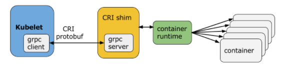

# Kubernetes Interface

|接口|全称|管的资源|提供者角色|
| ------| -----------------------------| ------------------| ----------------------------------|
|CRI|Container Runtime Interface|计算(容器怎么跑)|Container Runtime(**containerd**/CRI-O等)|
|CNI|Container Network Interface|网络|CNI插件(Flannel/Calico/Cilium等)|
|CSI|Container Storage Interface|存储|CSI Driver(各存储厂商)|

CRI、CSI、CNI 是 Kubernetes 架构里最底层的三个"插件接口"，分别负责容器运行时、存储、网络这三个基础设施层面的能力，它们共享同一个设计哲学——**Kubernetes 只定义"应该有什么能力"的规范，从不亲自实现具体技术，把"怎么实现"完全留给外部厂商竞争提供**



> Kubernetes默认使用Docker作为容器运行时（CRI 后端）

‍

### CRI接口——由Container Runtime实现

**架构**：两个gRPC服务

|服务|职责|
| ----------------| ---------------------------------------|
|RuntimeService|容器和 Sandbox(Pod沙箱)的生命周期管理|
|ImageService|镜像的拉取、查看、删除|

> 设计理由：容器运行时与镜像的生命周期是彼此隔离的

**通信方式**：Container Runtime 实现 gRPC Server（监听本地 Unix socket）  
kubelet 作为 gRPC Client，通过`containerd.sock`​跟容器运行时通信（协议是基于Protocol Buffer的**gRPC）**

‍

|阶段|方法|
| --------------------------| -------------------------------------------------------------------------------------------------------|
|Sandbox(Pod级别)生命周期|RunPodSandbox / StopPodSandbox / RemovePodSandbox / PodSandboxStatus / ListPodSandbox|
|容器生命周期|CreateContainer / StartContainer / StopContainer / RemoveContainer / ListContainers / ContainerStatus|
|交互式操作|ExecSync / Exec / Attach / PortForward|
|监控|ContainerStats / ListContainerStats|

- `RunPodSandbox`​ 创建持有网络命名空间的隐藏容器，之后 `CreateContainer`​ 才是应用开发者创建在 `spec.containers` 里声明的真正业务容器
- `StopPodSandbox`​、`RemoveContainer`​ 等都要求**幂等**

‍

### CNI接口——由CNI插件(Flannel/Calico/Cilium等)实现

```zsh
type CNI interface {
    AddNetworkList(...) (types.Result, error)
    DelNetworkList(...) error
    AddNetwork(...) (types.Result, error)
    DelNetwork(...) error
}
```

CNI仅关心容器创建时的网络分配，和当容器被删除时释放网络资源

|规则类别|具体内容|
| ------------| ----------------------------------------------------------------------|
|执行顺序|运行时必须先创建网络命名空间，再调用插件|
|配置格式|JSON，包含必填的 name/type，可选的 args|
|操作配对|ADD 后必须跟着对应的 DEL；DEL 可以重复调用|
|并发限制|同一个容器不能并行调用；不同容器可以并行|
|唯一性约束|同一个 ContainerID 不能对同一个网络重复 ADD（没有对应 DEL 的情况下）|

|插件类别|作用|举例|
| --------------------| -----------------------| --------------------------------|
|Main（接口创建）|真正创建/配置网络接口|bridge、macvlan、ptp、loopback|
|IPAM（IP地址管理）|决定分配哪个IP|dhcp、host-local|
|Meta（其它）|辅助功能|flannel、portmap、tuning|

> IPAM单独拆出来的原因：CNI 插件负责"怎么把网卡插进容器里"，IPAM 插件负责"这张网卡该分配哪个 IP"，两者职责分开，避免每个网络插件都要重复实现一遍 IP 分配逻辑。

‍

### CSI接口——由CSI Driver(各存储厂商)实现

定义：CSI Driver（比如 `ebs.csi.aws.com`​）指的是**存储厂商提供的整套解决方案**，这套方案实际上是**两组 Pod，用两种不同方式部署出来的。**

"CSI Node Plugin"是实现了 CSI 规范里'Node那部分职责'的那个具体程序  
"CSI Controller Plugin"是实现了CSI规范里'Controller那部分职责'的那个具体程序

```zsh
CSI Driver（厂商提供的整套东西，比如 "AWS EBS CSI Driver"）
    │
    ├── ① Controller Plugin（部署成普通 Deployment，通常1-2个副本，不用每台Node一份）
    │      负责: 跟云厂商 API 打交道的事（创建/删除/Attach）
    │
    └── ② Node Plugin（部署成 DaemonSet，每个 Node 一份）
           负责: 在具体某台机器上真正执行 Mount 的事
```

```zsh
┌─────────────────────────────────────────┐   ┌─────────────────────────────────────────┐
│  Controller Plugin Pod（一个 Deployment） │   │  Node Plugin Pod（DaemonSet，每个Node一份）│
│                                           │   │                                           │
│  ┌─────────────────┐                     │   │  ┌─────────────────┐                     │
│  │ external-        │  ← sidecar①         │   │  │ driver-registrar │  ← sidecar③         │
│  │ provisioner      │  监听PVC             │   │  │ (node-driver-    │  向kubelet注册这个   │
│  │                  │  → 调用CreateVolume  │   │  │  registrar)      │  驱动               │
│  └────────┬─────────┘                     │   │  └────────┬─────────┘                     │
│  ┌────────▼─────────┐                     │   │  ┌────────▼─────────┐                     │
│  │ external-attacher │  ← sidecar②         │   │  │ 真正的 CSI Driver │  实现 Node服务:     │
│  │                  │  监听VolumeAttachment│   │  │ 容器(vendor提供)  │  NodeStageVolume/   │
│  │                  │  → 调用Attach/Detach │   │  │                  │  NodePublishVolume  │
│  └────────┬─────────┘                     │   │  └──────────────────┘  (真正执行mount命令) │
│  ┌────────▼─────────┐                     │   │                                           │
│  │ 真正的 CSI Driver │  实现Controller服务:│   │                                           │
│  │ 容器(vendor提供)  │  CreateVolume/       │   │                                           │
│  │                  │  ControllerPublish   │   │                                           │
│  └──────────────────┘  (真正调云厂商API)   │   │                                           │
└─────────────────────────────────────────┘   └─────────────────────────────────────────┘
```

|Sidecar|贴在哪个 Plugin 旁边|干什么|
| ---------| ----------------------| -----------------------------------------------------------------------------------------|
|`external-provisioner`|Controller Plugin|监听 PVC 对象的创建，翻译成对"真正的CSI Driver容器"的 `CreateVolume` gRPC调用|
|`external-attacher`|Controller Plugin|监听 VolumeAttachment 对象，翻译成对"真正的CSI Driver容器"的 `ControllerPublishVolume`（也就是Attach操作）调用|
|`driver-registrar`|Node Plugin|告诉这台机器上的 `kubelet`："我这个驱动能处理 Mount 相关的操作，有需要找我"|

> **每个 sidecar 只做"监听 Kubernetes 对象 → 转换成 gRPC 调用"这一件事**

‍

**例子**

```zsh
① 你 kubectl apply 一个 PVC
      ↓
② Controller Plugin 里的 external-provisioner 监听到这个PVC
      ↓ 调用同一个Pod里"真正的CSI Driver容器"的 CreateVolume
③ 这个容器真的去调 AWS API，创建一块EBS卷
      ↓
④ Kubernetes 自动生成对应的 PV，绑定给你的 PVC
      ↓
（等到某个 Pod 真的要用这块卷、被调度到某台 Node 上时）
      ↓
⑤ Controller Plugin 里的 external-attacher 监听到 VolumeAttachment
      ↓ 调用 ControllerPublishVolume（Attach这一步）
⑥ 这块EBS卷被真的"接"到目标 Node 上（AWS层面的操作）
      ↓
⑦ 目标 Node 上的 Node Plugin（这台机器自己的DaemonSet实例）
      ↓ 调用 NodeStageVolume + NodePublishVolume（Mount这一步）
⑧ 这台机器执行真正的 mount 命令，Pod 终于能读写这块存储了

```
