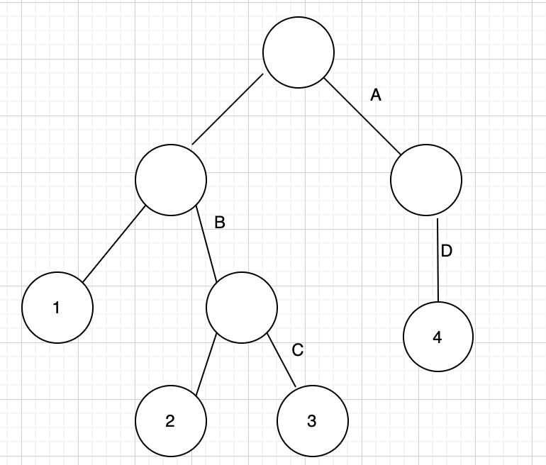
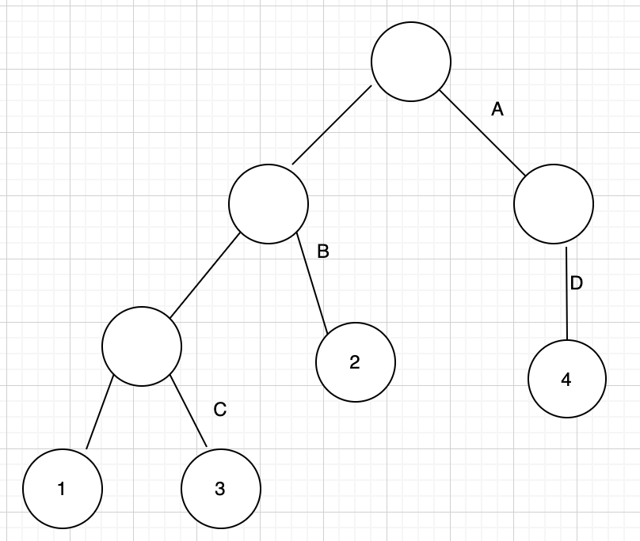
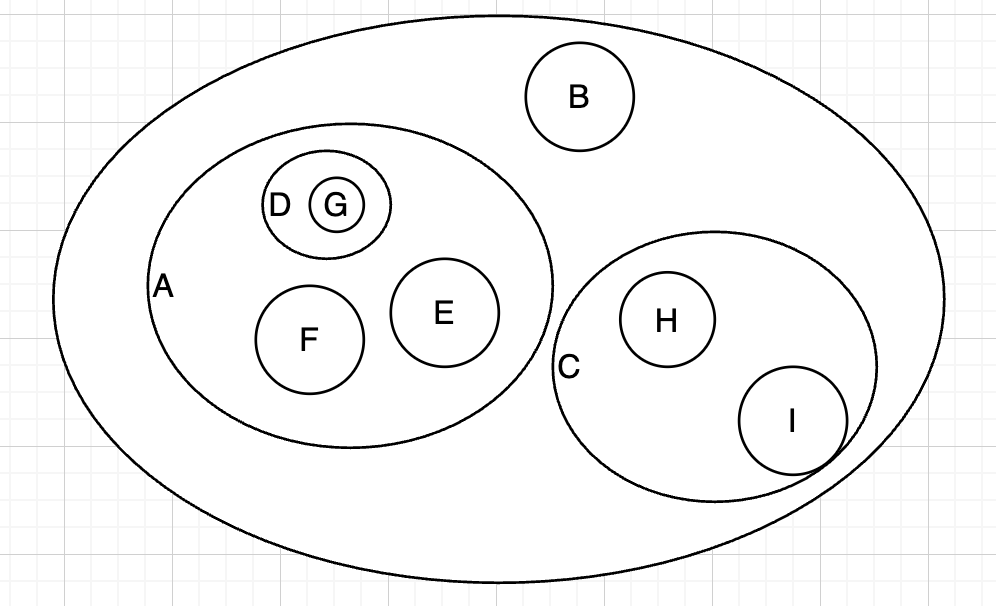
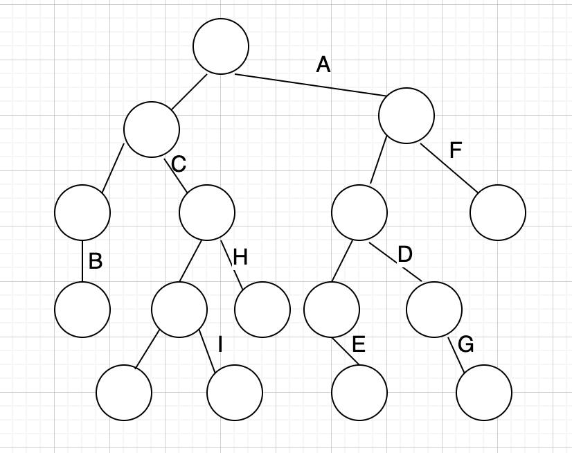

# Cow Evolution

[USACO Cow Evolution](https://usaco.org/index.php?page=viewproblem2&amp;cpid=941)

### 找直觉

我们看看一个进化树的特点

  
这2个进化树中，根节点根据是否具有特征A将{1,2,3,4}划分为了两类: {1,2,3},{4}。第一棵树中{1,2,3}根据特征B划分为了{1}, {2,3}。在B="是"的子集{2,3}根据特征C划分为了{2},{3}；第二棵树中{1,2,3}根据特征B划分为了{1,3}, {2}。在B="否"的子集{1,3}根据特征C划分为了{1},{3}

> 观察：对于两个不同特征X, Y, 它们对应的进化节点只可能是2种情况：
>
> 1. 一方是一方的祖先，不妨假设X是Y的祖先（例如图1.1与1.2中，B是C的祖先）
> 2. 双方都不是对方的祖先，即存在共同祖先Z（例如图1.1中特征B和D对应的分支节点有共同祖先A的分支节点）

情况一中，进化出X的子树要不包含含有进化出Y的子树（Y进化节点落在X="是"的进化分支），要不与进化出Y的子树没有交集（Y进化节点落在X="否"的分支）。即$X \supseteq Y$ 或 $X \cap Y = \emptyset $  
情况二中，X与Y进化节点作为根节点的2棵树必然是一个树为非Z分支，另一个树为Z分支。从而$X \cap Y = \emptyset$

以上，我们说明了二叉树是一颗进化树的必要条件是：对任意不同2个特征X，Y，进化为"是"的子树(子集)一定满足 $X \supseteq Y$ 或者 $X \subseteq Y$ 或者 $X \cap Y = \emptyset$。

反过来，如果对任意不同2个特征X，Y，取值为"是"的子集一定满足 $X \supseteq Y$ 或者 $X \subseteq Y$ 或者 $X \cap Y = \emptyset$。我们是否可以构建一棵进化树？以一张韦恩图来直观的理解：



它对应一棵进化树：



‍

### 进化树构造过程

我们从任何一个不被任何其他集合包含的集合X开始（例如上图的A），那么其他进化出Y的集合要么落在X内部（即进化出特征Y的牛一定已经进化出特征X了），要么全部落在X外部（进化出Y的牛群一定没有进化出X）。于是将其他特征组成的集合划分为了"X内部"和"X外部"2类（例如上图的{B,C,H,I}, {F,D,E,G} 。接着递归地分别对X左孩子（如{B,C,H,I}）和右孩子（如{F,D,E,G}）进行划分。

例如，对{B, C, H, I}进行划分，选取一个不被任何其他集合包含的集合如C，$B \cap C = \emptyset$，故B划分为"C外部"，左孩子。{H,I}均为C内部，故右孩子。

一直这样划分下去，每选取一个划分特征，创建一个进化节点（一定有右孩子，不一定有左孩子），直到剩余特征为空。每个叶子节点就是一个sub-population（具有不同的特征组合）。

图1.4中:

|population id (叶子)|0|1|2|3|4|5|6|
| ----------------------| ---| ---| -----| -----| -----| -------| -----|
|**features**|B|C|C,I|C,H|A,E|A,D,G|A,F|

|features|A|B|C|D|E|F|G|H|I|
| ----------| ---------| ---| ---------| ---| ---| ---| ---| ---| ---|
|**population id (叶子)**|4, 5, 6|0|1, 2, 3|5|4|6|5|3|2|

### 判断若干sub-population是否能被进化树生成

目标：给定N个具有不同特征组合的sub-population，确定是否存在一棵进化树，它的叶子节点对应这些sub-population。  
分析：只需判别对任意两个特征包含的populations，检查是否满足上述提到的性质，即不相交或一方是另一方超集。  
例如，图1.4中给出了7个population对应的特征组合，可计算不同特征涵盖的populations，发现它们满足上述性质。例如population(A) = {4,5,6} 与 population(C) = {1,2,3}不相交。population(A) 包含population(D)...

‍

### 代码

```cpp
	int N;
    cin >> N;
    map<string, set<int>> cows; // cows[feature] = a set of sub-populations
    set<string> all_feats;
    for (int i = 0; i < N; ++i) {
        int k;
        cin >> k;
        for (int j = 0; j < k; ++j) {
            string feature;
            cin >> feature;
            cows[feature].insert(i);
            all_feats.insert(feature);
        }
    }
    vector<string> all_feats_vec(all_feats.begin(), all_feats.end());
    for (int i = 0; i < all_feats_vec.size(); ++i) {
        for (int j = i+1; j < all_feats_vec.size(); ++j) {
            const auto &s1 = cows[all_feats_vec[i]];
            const auto &s2 = cows[all_feats_vec[j]];
            bool only_a = false, only_b = false; // 是否存在元素属于s1但不属于s2，属于s2但不属于s1
            bool both = false; // 是否存在元素同时属于s1与s2
            for (int sub_population = 0; sub_population < N; ++sub_population) {
                bool has_a = s1.count(sub_population);
                bool has_b = s2.count(sub_population);

                if (has_a && !has_b) {
                    only_a = true;
                } else if (!has_a && has_b) {
                    only_b = true;
                } else if (has_a && has_b) {
                    both = true;
                }
            }
            if (only_a && only_b && both) { // 违反进化树条件
                cout << "no" << '\n';
                return 0;
            }

        }
    }

    cout << "yes" << '\n';
```
